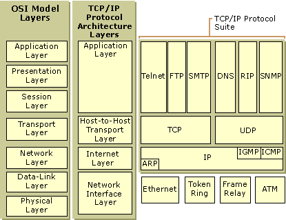

**network note**

network note

<!--more-->

[TOC]

# 1. 网络模型



ref: [TCP/IP Protocol Architecture](https://technet.microsoft.com/en-us/library/cc958821.aspx)

# 2. TCP


# 3. UDP

## 3.1 UDP程序流程

```
socket = socket(AF_INET, SOCK_DGRAM, IPPROTO_UDP);
int sendto  (s, pBuf, nBufLen, nFlag, sockAddr, nAddrLen);
int recvfrom(s, pBuf, nBufLen, nFlag, sockAddr, nAddrLen);

send:
	init, sendto, clean
recv:
	init, bind, recvfrom, clean
```

## 3.2 UDP报文结构

```
ip头||                    ip数据
ip头||        udp头          || udp数据
... ||源端口|目的端口|长度|校验|| ...
20B || 2B   |  2B   | 2B| 2B || 0-65507B
```

最大长度：由于UDP长度最长2字节（2^16-1），扣除头开销20+8，剩余65535-28=65507字节

MTU与分片：如果IP包长度大于MTU，则会分片为多个数据帧（由IP层实现）

超出后处理：如果UDP包长度大于65507，需要程序自己拆分，否则sendto返回长度错误（10040 WSAEMSGSIZE windows, EMSGSIZE 90 linux)

windows UDP问题：[windows下发送UDP包大于1024时速度下降](https://blog.csdn.net/wanglx_/article/details/53534804), 由于windows特性引起，可通过注册表修改

# 4. IPV6

```
1. 所有公网ip地址都是连接在一起的。因此，只要拥有公网ip地址就可以互相连通，ipv6也是（排除防火墙等例外情况）。所谓的全链路ipv6是指其实是指某个服务全部使用ipv6地址，而非指连通性：拥有ipv6地址的机器一定可以互联，但是请求到达ipv6后，后续处理不一定通过ipv6实现，如localdns支持ipv6时，请求其他dns时可能通过ipv4地址实现。

2. 地址解析
一般先向localdns请求ipv6地址（AAAA记录），然后又localdns迭代请求或缓存返回结果。

3. ipv6地址后缀%问题
https://www.cnblogs.com/daoyuly/p/3159912.html
简单来说，就是对于自己分配的非公网ipv6地址，为了区分这个地址是在哪个端口（一般是指网卡）而添加的后缀。具体含义和操作系统相关。如：
fe80::d84b:8939:7684:a5a4%7
因为对于私有ipv6地址，很可能是多个分割开的网络，所以要指明通过哪个接口到达。
```

