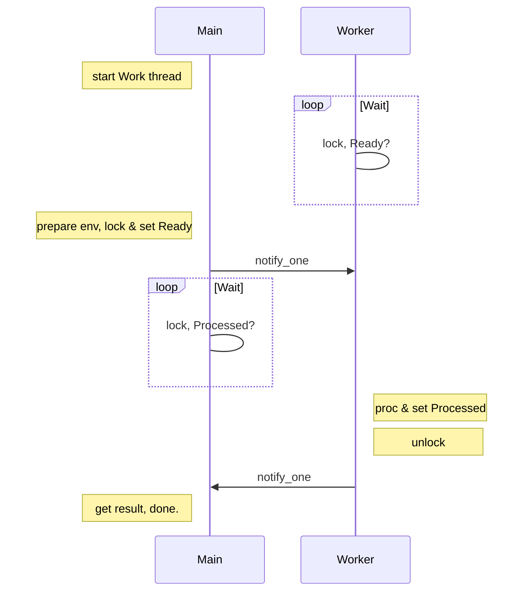

# Note for STL thread support library

Note for thread, mutex & RAII wrapper,  condition variables and features in STL, since C++11.

<!--more-->

[TOC]

## 1. thread


### function members in this_thread

- yield()
- get_id()
- sleep_for(duration)
- sleep_for(time_point)

### notes

 - return value of thread function is ignored.
 - throw exception in thread function will call std::terminate.
 - use standard thread promise & future to return value and exception for caller
 - yield will release cpu so other thread can use it. 
 - if thread function is T&, std::ref should used
```C++
void ThreadFunc(vector<int>& v)
{
  ...
}

void main(void)
{
  vector<int> v
  thread t1(ThreadFunc, v); // wrong, will cause copy of V
  thread t2(ThreadFunc, std::ref(v)); // right.
}
```

### test for yield

NY: thread no yield
WY: thread with yield

| cond      | NY%  | WY%  | DETAIL               |
| --------- | ---- | ---- | -------------------- |
| NY*1      | 100% |      |                      |
| WY*1      |      | 100% |                      |
| (2-4)NY   | 100% |      | Load balanced        |
| (2-4)WY   |      | 100% | Load unbalanced      |
| 1 NY, 1WY | 100% | 0%   |                      |
| 4 NY, 4WY | 100% | 0%   | about 64 NY per sec. |


*conclusion*:

if cpu is busy, yield will wait till next cpu time slice
if cpu is spare, yield will use all cpu time.

## 2. mutex

- mutex
  exclusive, non-recursive ownership,
- timed_mutex
  like as mutex, plus timeout lock (try_lock_for/until())
- recursive_mutex
  exclusive, recursive ownership. lock/unlock must match
- recursive_timed_mutex
  like as recursive_mutex, plus timeout lock (try_lock_for/until()).
- shared_mutex(c++17)
  exclusive or shared ownership. lock_shared() will block lock(). for RW lock
- shared_timed_mutex(c++14)
  like shared_mutex, plus timeout lock

## 3. functions

- void lock(Locakable& lock1, ...)

  deadlock avoidance, unspecified lock order, unlock all when exception.

- int try_lock(Locakable& lock1, ...)

  lock in order from first, unlock all when failed or exception.
  return:  -1: success, 0-based failed lock object.

- template< class Callable, class... Args >

  void call_once( std::once_flag& flag, Callable&& f, Args&&... args )

## 4. RAII wrapper

### wrappers

- lock_guard
  one mutex, non-copyable, non-movable. no member functions.
- scoped_guard(17)
  one or more mutexes, reverse order release, deadlock avoidance. non-copyable. no member functions.
- unique_lock
  movable but non-copyable, rich functions support.
- shared_lock(14)
  movable but non-copyable. can work with condition_variable_any, but not condition_variable

### function members

only for unique_lock / shared_lock

-  operator=(&&)
-  lock / try_lock / try_lock_for / try_lock_until / unlock
-  swap / release (but not unlock automatically)
-  mutex / owns_lock / operator bool

### locking strategy

lock_guard only support adopt_lcok

- defer_lock
- try_to_lock
- adopt_lock

## 5. condition variables

block a thread, until another thread both *modifies* a shared variable (the *condition*), and *notifies* the condition_variable.

### classes

- condition_variable
- condition_variable_any

### function members of cv

- wait / wait_for / wait_until 
  atomically release mutex and suspend, atomically reacquire mutex when awaken.
- notify_one / notify_all
  the lock does not need to be held for notification

### functions of cv

`void notify_all_at_thread_exit( std::condition_variable& cond, std::unique_lock<std::mutex> lk );`

- must lock before called.
- lock is transferred to internal storage
- unlock & notify_all after destruction of all local objects when thread exits.
- may be achieved with promise & packaged_task
- no other can acquire lock  after called.
- In typical use cases, this function is the last thing called by a detached thread.

### cv_status

describes whether a timed wait returned because of timeout or not.

```
enum class cv_status {
    no_timeout,
    timeout   
};
```


### notes

- lock before wait
- wait will release lock
- wait will lock when awaken
- notify does not need lock

### standard routine


### sample code

```
#include <mutex>
#include <shared_mutex>
#include <thread>

#include <iostream>
#include <cstdint>
#include <string>
#include <chrono>

std::mutex m;
std::condition_variable cv;
std::string cvData;
bool ready = false;
bool processed = false;

void WorkerThread(void)
{
	// Wait until main() sends data
	std::unique_lock<std::mutex> lk(m);
	cv.wait(lk, [] {return ready; });

	// after the wait, we own the lock.
	std::cout << "<<-- Worker thread is processing data and sleep 2 seconds.\n";
	cvData += " after processing";
	this_thread::sleep_for(chrono::seconds(2));

	// Send data back to main()
	processed = true;
	std::cout << "<<-- Worker thread signals data processing completed\n";

	// Manual unlocking is done before notifying, to avoid waking up
	// the waiting thread only to block again (see notify_one for details)
	lk.unlock();
	cv.notify_one();
}

void main(void)
{
	std::thread worker(WorkerThread);

	cvData = "Example data";
	// send data to the worker thread
	{
		std::lock_guard<std::mutex> lk(m);
		ready = true;
		std::cout << "-->> main() data = " << cvData << '\n';
		std::cout << "-->> main() signals data ready for processing\n";
	}

	{
		std::lock_guard<std::mutex> lk(m);
		cv.notify_one();
		std::cout << "-->> main() notify_one but hold lock, sleep 2 seconds" << endl;
		this_thread::sleep_for(chrono::seconds(2));
		std::cout << "-->> main() release lock" << endl;


	}

	// wait for the worker
	{
		std::unique_lock<std::mutex> lk(m);
		cv.wait(lk, [] {return processed; });
	}
	std::cout << "-->> Back in main(), data = " << cvData << '\n';

	worker.join();
}
```

output:

```
-->> main() data = Example data
-->> main() signals data ready for processing
<<-- Worker thread is processing data and sleep 2 seconds.
<<-- Worker thread signals data processing completed
-->> Back in main(), data = Example data after processing
```

